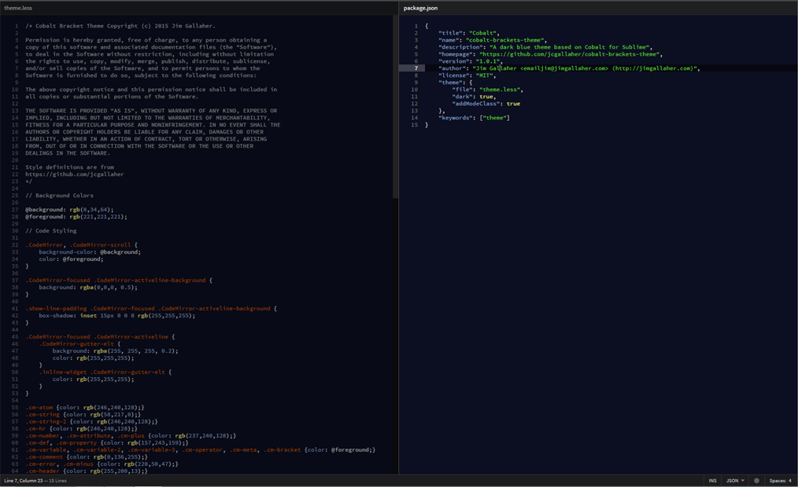

# Blackboard-bracket-theme

Blackboard for Brackets is based on Sublime Text's Blackboard theme.

## Version Changes

1.0.1 - The package.json file fixes the "update isn't compatible with this version" issue in the extension manager. Blackboard will now properly update when newer versions are made available.

**Note for those who may have version 1.0.0 installed** Due to a name change in version 1.0.0, this version will not update to version 1.0.1 or greater. If you have Blackboard version 1.0.0 installed, uninstall it through the extension manager, reload Brackets, and then search for the Blackboard theme in the extension manager to get the latest version of Blackboard.

## Installation

The easiest and quickest way to install the Blackboard theme is to download and install directly through the Brackets extension manager. The alternative is to download this repo by clicking Download ZIP in Github and install the zip file manually through the extension manager.

